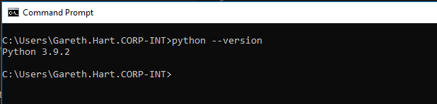
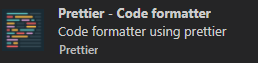
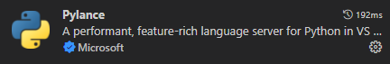

# Getting Started

Before starting the training we need to ensure you have a few things in place. Please follow the guides below on installing ptyhon3.9, git-scm and Visual Studio Code.

 

### Installing Python

For this training session we will recommend installing [python3.9](https://www.python.org/downloads/release/python-399/)

Once installed, you can verify your current version by opening command prompt and typing `python --version` which should return somethin similar to the image below

 

### Installing Visual Studio Code (and a few useful packages)

First download [VS Code](https://code.visualstudio.com/Download) and run the installer

Now we need to add a couple of packages that will help make your life much easier.

To do this click on the packages icon located on the right hand menu 

Search for the following packages and install them (some may require you yo restart VS Code)

***Prettier - Code Formatter*** 

***Python*** 

 

### Installing Git-SCM

Download [git-scm](https://git-scm.com/download/win)

Install the software and the provide the following response to the prompts:

1. `Select Destination Folder` : Accept the default path and click `Next` 
2. `Select Components` : Ensure `Git Bash Here` is checked and click `Next`
3. `Choosing default editor` : Choose `Use Visual Studio Code as default editor` and click `Next`
4. `Adjust your PATH environment` : Accept the default and click `Next`
5. `Configuring the line ending conversions` : Accept the default and click `Next`
6. `Configuring the terminal emulator to use with Git Bash` : Select `Use Windows' default console window` and click `Next`
7. click `Next` on any further options
8. open command prompt and enter `git --version` to verify the install worked